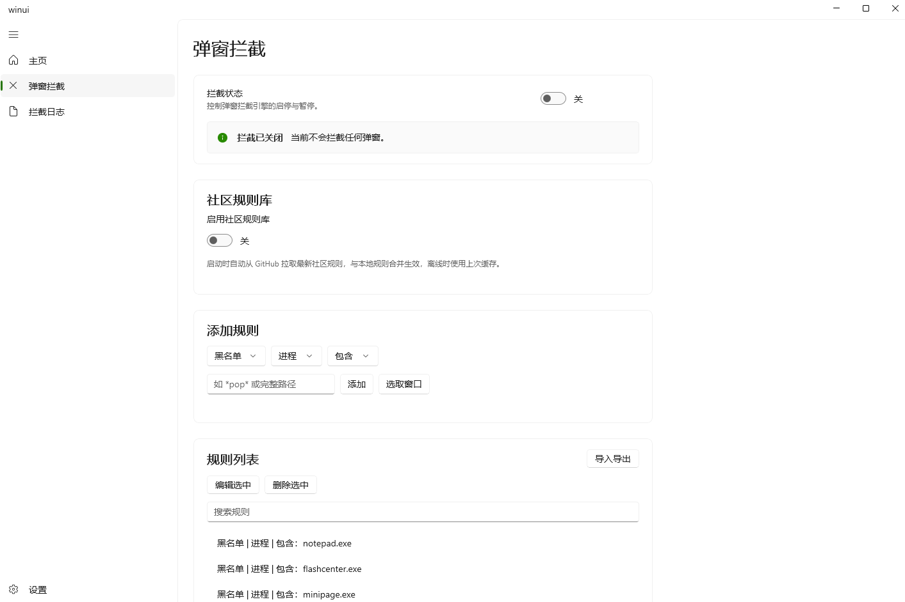

# PopKiller
> 基于 WinUI 3 (C++/WinRT) 的 Windows 弹窗拦截工具。
> 通过黑白名单规则、共享规则库、启发式特征打分与静态机器学习模型，自动识别并关闭广告及流氓软件弹窗。

[](LICENSE.txt)
[]()

---

## 目录
- [功能特性](#功能特性)
- [截图](#截图)
- [快速开始](#快速开始)
- [使用说明](#使用说明)
- [规则格式](#规则格式)
- [社区规则库](#社区规则库)
- [配置文件](#配置文件)
- [日志格式](#日志格式)
- [编译指南](#编译指南)
- [项目结构](#项目结构)
- [路线图](#路线图)
- [贡献规则](#贡献规则)
- [免责声明](#免责声明)
- [许可证](#许可证)

---

## 功能特性

| 模块 | 说明 |
| :--- | :--- |
| **规则引擎** | 支持 **进程名 / 完整路径 / 窗口标题 / 窗口类名** 四种匹配字段 |
| **匹配模式** | 包含（子串）/ 精确（全等）/ 通配符（`*` 与 `?`） |
| **黑白名单** | 黑名单拦截，白名单放行，*白名单优先级最高* |
| **规则编辑** | 选中已有规则可直接修改，无需删除后重加 |
| **规则导入导出** | 一键导出规则为 JSON 文件备份或分享，导入时自动去重合并；可选择是否包含社区规则与墓碑记录 |
| **社区规则库** | 启动时联网拉取仓库 `community_rules.json`，合并到本地规则，可编辑可删除，删除偏好自动记忆 |
| **启发式打分** | 对 20 余项特征（窗口样式、进程路径、数字签名、进程年龄等）加权评分 |
| **机器学习识别** | 内置随机森林与逻辑回归双 ONNX 模型，基于 23 维特征联合预测弹窗概率，当前为仅记录模式 |
| **窗口拾取** | 点选目标窗口，提取进程 / 路径 / 类名 / 标题，一键生成规则 |
| **系统托盘** | 最小化到托盘，右键菜单快速切换拦截状态 |
| **日志系统** | 实时刷新拦截日志，支持详细日志模式记录每个窗口的打分明细与机器学习预测结果 |

---

## 截图



---

## 快速开始

### 下载使用

从 [Releases](https://github.com/lmg325586/PopKiller/releases) 页面下载最新版压缩包，解压后运行 `winui.exe` 即可。

> 当前为 Beta 阶段，仅在 Windows 11 x64 下充分测试；Windows 10 可运行但 UI 可能存在显示问题。

### 首次使用

1. 运行程序，在「弹窗拦截」页打开总开关；
2. 程序会自动从 GitHub 拉取最新社区规则库（首次启动需联网）；
3. 点击「选取窗口」，点选目标弹窗，自动填充窗口信息；
4. 选择 **名单类型 / 匹配字段 / 匹配模式**，输入模式后点击「添加」；
5. 在「设置」页可开启开机自启、调整启发式模式、启用机器学习识别与详细日志开关。

---

## 使用说明

### 添加规则

1. 进入「弹窗拦截」页面；
2. 点击「选取窗口」按钮，鼠标变为十字准星，点选目标窗口；
3. 拾取后自动填充进程名、路径、类名、标题信息；
4. 在下拉框中选择：
   - **名单类型**：黑名单（拦截）/ 白名单（放行）
   - **匹配字段**：进程 / 路径 / 标题 / 类名
   - **匹配模式**：包含 / 精确 / 通配符
5. 确认模式内容后点击「添加」。

> 提示：如果添加的规则与已有相反名单规则内容相同，会弹出橙色警告——白名单优先级更高，该窗口将被放行。

### 编辑规则

1. 在规则列表中选中要修改的规则；
2. 点击「编辑选中」按钮，规则内容会回填到上方的输入框与下拉框，按钮文字变为「保存修改」；
3. 修改后点击「保存修改」完成更新；
4. 编辑社区规则时，原社区规则会被记入删除偏好（墓碑），修改后的规则保存为本地规则。

### 搜索与管理

- 在规则列表上方的搜索框输入关键词，可实时过滤规则；
- 选中规则后点击「编辑选中」修改规则，点击「删除选中」移除该规则；
- 删除社区规则后，该规则的键会被记入 `communityRemoved`，下次拉取时自动跳过；
- 所有规则（包括社区规则）自动保存到程序同目录的 `rules.json`。

### 导入导出规则

点击规则列表标题右侧的「导入导出」按钮，进入导入导出页面。

**导出规则：**
1. 选择是否「包含社区规则」（默认勾选）；
2. 选择是否「包含已禁用的社区规则（墓碑记录）」（默认勾选）；
3. 点击「选择保存位置…」，选择 JSON 文件保存路径；
4. 导出完成后显示导出的规则条数与墓碑记录条数。

**导入规则：**
1. 点击「选择规则文件…」，选择之前导出的 JSON 文件；
2. 程序会自动解析并与现有规则合并，重复规则自动跳过；
3. 导入的规则统一保存为本地规则（`fromCommunity=false`）；
4. 导入完成后显示新增条数与跳过重复条数。

> 导出的 JSON 文件可用于备份、多设备同步或分享给他人。导入时不会覆盖现有规则，仅合并新增项。

### 社区规则库

- 程序启动时自动从 GitHub 拉取最新 `community_rules.json`；
- 拉取的社区规则合并到本地规则列表中，**可编辑、可删除**；
- 删除社区规则后，该规则的键会被记入 `communityRemoved` 列表，下次拉取时自动跳过；
- 如需恢复已删除的社区规则，手动清空 `rules.json` 中的 `communityRemoved` 数组即可；
- 离线启动时使用上次缓存的规则；
- 拉取失败时状态文本显示错误信息并出现「重试」按钮。

### 启发式与机器学习

在「设置」页面可切换启发式引擎工作模式与机器学习识别开关：

**启发式模式：**

| 模式 | 说明 |
| :--- | :--- |
| **关闭** | 仅按黑白名单规则拦截，不进行启发式评估 |
| **仅记录** | 对所有窗口打分并写入日志，但不自动拦截（用于调参和观察） |
| **自动拦截** | 分数达到阈值（默认 70）的窗口自动关闭 |

**静态机器学习识别：**

- 内置两个 ONNX 模型：**随机森林**（`popup_rf.onnx`）与**逻辑回归**（`popup_lr.onnx`）；
- 基于 23 维特征联合预测：17 项窗口二值特征（含用户空闲>5秒 / 窗口离鼠标>300px）+ 标题长度 + 广告关键词命中数 + 白名单进程标记 + Chromium 类名标记 + 对话框类名标记 + exe 数字占比；
- 两个模型**同时预测为弹窗**时才判定为弹窗（双模型投票，降低误报）；
- 当前为**仅记录模式**：预测结果以 `ml=Y`（弹窗）/ `ml=N`（非弹窗）写入日志明细，不执行拦截；
- 启用后首次评估时自动加载模型，模型文件位于程序同目录 `StaticML\` 下。

> 机器学习模型基于社区贡献的标注样本训练，仍在持续优化中。欢迎贡献标注数据帮助提升准确率（见「贡献规则」）。

### 开机自启

在「设置」页面的「常规」卡片中开启「开机自启」：
- 开启后程序会在当前用户登录时自动启动；
- 通过注册表 `HKCU\...\CurrentVersion\Run` 实现，无需管理员权限；
- 兼容 Windows 10/11 的 StartupApproved 机制，不会被系统静默禁用；
- 如程序路径发生变化，下次启动时会自动更新注册表中的路径。

### 单实例运行

- 程序仅允许同时运行一个实例；
- 重复启动时自动激活已有窗口并前置显示；
- 如窗口最小化到托盘，会自动恢复并闪烁提示。

### 系统托盘

- 点击窗口最小化按钮，程序自动隐藏到系统托盘；
- 左键单击托盘图标恢复主窗口；
- 右键单击托盘图标弹出菜单，可快速切换拦截状态、显示主窗口或退出程序。

---

## 规则格式

规则以 JSON 格式保存在程序同目录的 `rules.json` 中：

```json
{
    "version": 1,
    "rules": [
        {
            "list": "B",
            "field": "exe",
            "mode": "contains",
            "pattern": "flashcenter.exe"
        },
        {
            "list": "W",
            "field": "exe",
            "mode": "contains",
            "pattern": "explorer.exe"
        },
        {
            "list": "B",
            "field": "title",
            "mode": "contains",
            "pattern": "热点",
            "source": "community"
        }
    ],
    "communityRemoved": []
}
```

| 字段 | 取值 | 说明 |
| :--- | :--- | :--- |
| `list` | `B` / `W` | 黑名单 / 白名单 |
| `field` | `exe` / `path` / `title` / `class` | 进程名 / 完整路径 / 窗口标题 / 窗口类名 |
| `mode` | `contains` / `exact` / `wildcard` | 包含 / 精确匹配 / 通配符 |
| `pattern` | 字符串 | 匹配内容（不区分大小写） |
| `source` | `community`（可选） | 标记该规则来自社区规则库 |
| `communityRemoved` | 字符串数组 | 用户删除过的社区规则键列表，下次拉取自动跳过 |

**通配符说明：**
- `*` 匹配任意长度的任意字符（包括空字符）
- `?` 匹配单个任意字符
- 匹配不区分大小写

---

## 社区规则库

### 工作原理

1. 程序启动时，从 GitHub 仓库根目录拉取 `community_rules.json`；
2. 拉取成功后，社区规则合并到本地 `rules.json` 中，标记 `source: "community"`；
3. 合并时自动去重，已存在的相同规则不会重复添加；
4. 用户删除社区规则后，规则键记入 `communityRemoved`，下次拉取时自动跳过该规则；
5. 离线启动时使用本地已缓存的规则。

### community_rules.json 格式

与本地 `rules.json` 格式一致：

```json
{
    "version": 1,
    "rules": [
        { "list": "B", "field": "exe",   "mode": "contains", "pattern": "flashcenter.exe" },
        { "list": "B", "field": "title", "mode": "contains", "pattern": "热点" },
        { "list": "W", "field": "exe",   "mode": "contains", "pattern": "wechat.exe" }
    ]
}
```

### 贡献

欢迎提交 PR 维护 `community_rules.json`：

1. Fork 本仓库；
2. 编辑根目录下的 `community_rules.json`，按格式添加规则；
3. 提交 PR，描述规则对应的弹窗来源和验证情况；
4. 审核通过后合并，所有用户下次启动即可自动获取新规则。

> 注意：请勿提交针对正常软件的误杀规则。部分系统进程已内置白名单保护

---

## 配置文件

程序同目录下的 `winui.ini` 保存所有配置：

| Section | Key | 默认值 | 说明 |
| :--- | :--- | :--- | :--- |
| Blocker | Enabled | 0 | 拦截总开关（0=关，1=开） |
| Blocker | CommunityRulesEnabled | 1 | 社区规则库开关（0=关，1=开） |
| Blocker | ForceBlock | 0 | 强制拦截（忽略弹窗形态判断，命中黑名单即关） |
| Blocker | HeuristicMode | 0 | 启发式模式（0=关闭，1=仅记录，2=自动拦截） |
| Blocker | HeuristicThreshold | 70 | 启发式拦截分数阈值 |
| Blocker | MLHeuristic | 0 | 静态机器学习识别（0=关，1=开，仅记录模式） |
| Blocker | VerboseLog | 0 | 详细日志（0=仅记录拦截，1=记录所有窗口） |
| UI | Material | 0 | 界面材质（0=普通，1=Mica） |

本地规则保存在同目录的 `rules.json`，拦截日志保存在 `blocklog.txt`，标注数据保存在 `labels.json`。

---

## 日志格式

拦截日志保存在程序同目录的 `blocklog.txt`，UTF-8 编码（带 BOM）

**示例：**

```text
2026-08-21 14:30:15 action=block | ev=SHOW | reason=heuristic(75) | owner+15 toolwin+12 topmost+20 notresizable+12 nominmax+12 small+28 notitle+20 young+5 unsigned+12 idle+5 nearmouse+8 raw=FTTFFFFTFTFFTFFTFF ml=Y | title= | class=WindowsForms10.Window.8.app.0.1234567 | exe=adpopup.exe
2026-08-21 14:30:20 action=allow | ev=FG | reason=whitelist | title=文件资源管理器 | class=CabinetWClass | exe=explorer.exe
```

| 字段 | 说明 |
| :--- | :--- |
| 时间戳 | `YYYY-MM-DD HH:MM:SS` 格式的本地时间 |
| `action` | `block`（拦截）/ `monitor`（观察）/ `allow`（白名单放行） |
| `ev` | 触发事件：`SHOW`（窗口显示）/ `FG`（切换到前台） |
| `reason` | `blacklist` / `whitelist` / `community` / `heuristic(分数)` |
| 明细 | 启发式各项得分，如 `toolwin+12`、`signed-5`（仅启发式命中时出现） |
| `raw` | 17 位窗口特征串（T/F），启用启发式时输出 |
| `ml` | 机器学习预测结果（`Y`=弹窗 / `N`=非弹窗），启用 ML 时输出 |
| `title` | 窗口标题（小写） |
| `class` | 窗口类名（小写） |
| `exe` | 进程名（小写） |

在「拦截日志」页面可实时查看日志，支持手动刷新和清空。日志文件超过 1 MiB 时自动截断。

---

## 编译指南

### 编译环境

| 项目 | 要求 |
| :--- | :--- |
| IDE | Visual Studio 2026 |
| 工作负载 | 使用 C++ 的桌面开发 |
| SDK | Windows App SDK (WinUI 3) 1.4+ |
| 语言标准 | C++17 及以上 |
| 系统 | Windows 10 1809+ / Windows 11 |

### 第三方依赖

- [nlohmann/json](https://github.com/nlohmann/json) — JSON 解析（已包含在 `vendor/` 目录）
- [Microsoft.ML.OnnxRuntime](https://www.nuget.org/packages/Microsoft.ML.OnnxRuntime) — ONNX 模型推理引擎（NuGet 自动还原，用于机器学习识别）
- Windows App SDK — WinUI 3 框架（NuGet 自动还原）

### 编译步骤

```bash
# 克隆仓库
git clone https://github.com/lmg325586/PopKiller.git
cd PopKiller
```

1. 双击 `winui.slnx` 打开解决方案；
2. 选择 `x64 / Release` 配置；
3. 生成解决方案（首次生成会自动还原 NuGet 包，包括 Windows App SDK 与 ONNX Runtime）；
4. 输出目录下的 `winui.exe` 即为可执行文件；
5. 确保 `StaticML\` 目录下的两个 `.onnx` 模型文件与 `winui.exe` 在同一目录层级。

> 注意：运行时需要 [Windows App SDK 运行时](https://learn.microsoft.com/zh-cn/windows/apps/windows-app-sdk/downloads)。Release 打包中已包含完整运行时，自行编译时如提示缺少运行时，请安装对应版本。

---

## 项目结构

```
PopKiller/
├── community_rules.json      # 社区共享规则库
├── README.md                  # 项目说明
├── LICENSE.txt                # MIT 许可证
├── winui.slnx                 # Visual Studio 解决方案
├── StaticML/                  # 机器学习模型文件
│   ├── popup_rf.onnx          # 随机森林模型
│   └── popup_lr.onnx          # 逻辑回归模型
├── ML/                        # 模型训练脚本
│   ├── train.py               # 训练主脚本（5折交叉验证 + 多模型对比 + ONNX导出）
│   ├── start.bat              # 训练启动脚本
│   └── cache/                 # 样本缓存与去重
│       ├── dedup.py           # 样本去重脚本
│       └── start.bat
└── winui/                     # 主项目
    ├── App.xaml(.cpp/.h)      # 应用入口（含单实例逻辑）
    ├── MainWindow.xaml(.cpp/.h) # 主窗口（导航、托盘、最小尺寸）
    ├── HomePage.xaml(.cpp/.h)   # 首页（系统信息、辉光效果）
    ├── PopupBlockerPage.xaml(.cpp/.h) # 拦截规则页
    ├── RuleIOPage.xaml(.cpp/.h/.idl)  # 规则导入导出页
    ├── SettingsPage.xaml(.cpp/.h)     # 设置页（外观、拦截、自启、关于）
    ├── BlockLogPage.xaml(.cpp/.h)     # 拦截日志页
    ├── LicensePage.xaml(.cpp/.h)      # 许可证页
    ├── PopupBlocker.h          # 拦截引擎核心（钩子、匹配、日志、强杀、社区规则拉取）
    ├── HeuristicScorer.h       # 启发式打分引擎
    ├── HeuristicML.h           # 静态机器学习识别（ONNX 双模型推理）
    ├── RuleTypes.h             # 规则类型定义与工具函数
    ├── RuleStorage.h           # 规则 JSON 读写存储与序列化
    ├── LabelStorage.h          # 日志标注数据存储与训练样本导出
    ├── FilePicker.h            # 公共文件选择器
    ├── AutoStart.h             # 开机自启动管理
    ├── WindowPicker.h          # 窗口拾取器
    ├── TrayIcon.h              # 系统托盘
    ├── AppSettings.h           # 配置读写（ini）
    ├── AppTheme.h              # 主题与标题栏
    ├── vendor/json.hpp         # nlohmann/json 库
    └── Assets/
```

---

## 路线图

- [x] 黑白名单规则引擎
- [x] 通配符与路径匹配
- [x] 窗口拾取工具
- [x] 启发式特征打分
- [x] 数字签名校验
- [x] 详细日志开关
- [x] 系统托盘支持
- [x] 规则存储 JSON 化
- [x] 社区规则库联网拉取与合并
- [x] 社区规则可编辑、删除偏好记忆
- [x] 开机自启
- [x] 单实例运行
- [x] 规则编辑
- [x] 规则导入/导出
- [x] 日志大小限制与轮转
- [x] 日志标注与训练样本导出
- [x] 静态机器学习识别（当前:仅记录模式）
- [ ] 规则分组/标签

---

## 贡献规则

欢迎贡献代码、规则和反馈：

1. **社区规则**：提交 PR 修改 `community_rules.json`，请在描述中说明规则对应的弹窗来源；
2. **训练样本**：在日志页右键标注弹窗/误关，点击「导出训练数据」保存为 JSON，提交 PR 帮助优化机器学习模型；
3. **功能建议**：欢迎在 Issue 中讨论新功能想法。

---

## 免责声明

> 本工具仅供学习与研究使用。
>
> 启发式打分基于经验权重，机器学习模型基于有限样本训练，均存在误判可能；社区规则由用户贡献，未经逐一验证。
>
> 使用本工具造成的任何直接或间接损失，作者不承担责任。
>
> 如遇正常软件被误拦截，请添加白名单规则，或提交 Issue / PR 帮助改进。

---

## 许可证

[MIT License](LICENSE.txt)
